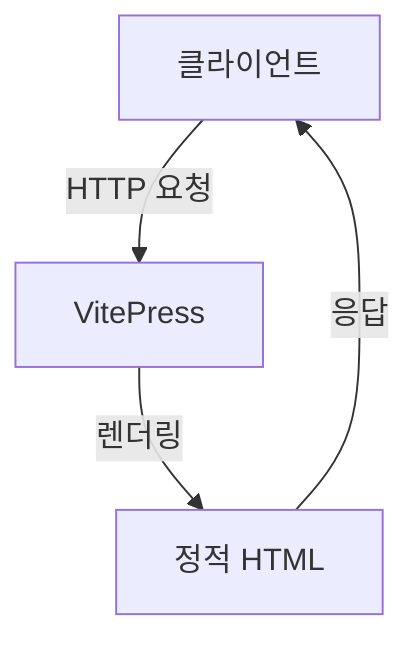

<!-- README.md: cblogs VitePress 기반 정보전달 블로그 플랫폼 | 생성일: 2026-04-09 | 수정일: 2026-04-16 -->

# cblogs

VitePress 기반 정보전달 블로그 플랫폼. 자동 카테고리 스캔, GFM Alert, 이모지, Mermaid 다이어그램 지원. Docker Compose로 개발/프로덕션 환경 제공.

---

## 프로젝트 개요

**cblogs**는 마크다운 기반의 정보전달 블로그입니다. 문서를 `docs/posts/{category}/{subcategory}/*.md` 구조로 작성하면, 자동으로:

- 사이드바 계층 트리 구성
- 홈페이지 카테고리 카드 생성
- 전문 검색 색인 생성

기본 Frontmatter로 메타데이터(제목, 설명, 날짜, 태그)를 관리하며, **재시작 없이** HMR(Hot Module Replacement)로 변경사항이 즉시 반영됩니다.

### 핵심 기능

- **자동 카테고리 스캔** — `posts/` 디렉터리 구조를 읽어 사이드바·카드 자동 생성
- **GFM Alert** — 5가지 경고창 (NOTE, TIP, IMPORTANT, WARNING, CAUTION)
- **이모지 Shortcode** — `:bulb:` → 💡, `:warning:` → ⚠️ 등 (markdown-it-emoji)
- **Mermaid 다이어그램** — 마크다운 코드블록에서 자동 렌더링
- **Dark Mode** — 테마 자동 전환 (CSS 변수로 커스터마이즈 가능)
- **Local Search** — 전체 문서 검색 (오프라인 작동)

---

## 프로젝트 구조

```
cblogs/
├── docs/                           # 문서 소스
│   ├── .vitepress/
│   │   ├── config.ts               # VitePress 설정 + 포스트 자동 스캔
│   │   ├── theme/
│   │   │   ├── index.ts            # 테마 진입점
│   │   │   ├── components/         # Vue 커스텀 컴포넌트
│   │   │   └── style.css           # 글로벌 스타일
│   │   └── dist/                   # 빌드 출력
│   ├── public/
│   │   ├── images/                 # 이미지 (Markdown 내 /images/diagram.png)
│   │   ├── files/                  # PDF 등 다운로드 파일
│   │   └── CNAME                   # Custom domain (선택)
│   ├── posts/
│   │   ├── tech/                   # 기술 카테고리
│   │   │   ├── frontend/           # 프론트엔드 서브카테고리
│   │   │   ├── backend/            # 백엔드
│   │   │   ├── devops/             # DevOps
│   │   │   └── ai/                 # AI/ML
│   │   ├── life/                   # 라이프 카테고리
│   │   │   ├── productivity/       # 생산성
│   │   │   ├── review/             # 리뷰
│   │   │   └── travel/             # 여행
│   │   ├── dev/                    # 개발일지
│   │   │   ├── tooling/            # 도구
│   │   │   └── troubleshooting/    # 트러블슈팅
│   │   └── linux/                  # 리눅스
│   │       └── server/             # 서버
│   └── index.md                    # 홈페이지
├── Dockerfile                      # 프로덕션 멀티스테이지 빌드
├── docker-compose.yml              # 프로덕션 환경
├── docker-compose.dev.yml          # 개발 환경 (HMR + 볼륨 마운트)
├── nginx.conf                      # nginx 서빙 설정
├── package.json
├── package-lock.json
└── README.md
```

---

## 빠른 시작

### 개발 환경 (Docker Compose + HMR)

```bash
# 시작 — 파일 변경 자동 감지 + 브라우저 자동 새로고침
docker compose -f docker-compose.dev.yml up -d

# 로그 확인
docker compose -f docker-compose.dev.yml logs -f

# 중지
docker compose -f docker-compose.dev.yml down
```

접속: **http://localhost:3031**

### 프로덕션 환경 (Docker Compose)

```bash
# 빌드 및 시작
docker compose up -d --build

# 로그 확인
docker compose logs -f

# 중지
docker compose down

# 완전 삭제 (이미지 포함)
docker compose down --rmi all --volumes
```

### 로컬 실행 (Node.js 20+)

```bash
# 의존성 설치
npm install

# 개발 서버 (파일 변경 자동 감지)
npm run docs:dev

# 프로덕션 빌드
npm run docs:build

# 빌드 결과 로컬 프리뷰
npm run docs:preview
```

접속: **http://localhost:3031**

> [!NOTE]
> 포트 3031은 `docs/.vitepress/config.ts`의 `vite.server.port`에서 설정됩니다.

---

## 문서 작성 포맷 가이드

### Frontmatter 필수 필드

모든 포스트는 파일 상단에 YAML 형식의 메타데이터를 작성합니다:

```yaml
---
title: "제목 — 50~60자 (검색어 포함)"
description: "150~160자 요약 (Google 검색 스니펫용)"
excerpt: "카드에 표시되는 짧은 한 줄"
date: 2026-04-16
category: linux
subcategory: server
tags: [keyword1, keyword2]
---
```

| 필드 | 설명 | 예시 |
|------|------|------|
| `title` | 포스트 제목 (H1로 자동 렌더링) | `"Ubuntu 24.04 nginx HTTPS 설정 — 10분 완성"` |
| `description` | SEO용 메타 설명 (150~160자) | `"Ubuntu 24.04 서버에 nginx와..."` |
| `excerpt` | 홈 카드에 표시되는 요약 (한 줄) | `"certbot 한 줄로 HTTPS 전환..."` |
| `date` | 발행 날짜 (YYYY-MM-DD) | `2026-04-16` |
| `category` | 대분류 (posts/ 하위 폴더명) | `linux`, `tech`, `life`, `dev` |
| `subcategory` | 중분류 (카테고리 하위 폴더명) | `server`, `frontend`, `productivity` |
| `tags` | 검색 태그 배열 | `[Ubuntu, nginx, HTTPS, SSL]` |

### SEO 권장 규칙

1. **H1은 페이지당 정확히 1개** — Frontmatter `title`이 자동으로 H1이 됨. 본문에 추가 H1 금지.
2. **섹션은 `##` (H2)부터 시작** — H1 중복 사용 금지.
3. **첫 문단에 타겟 키워드 포함** — 검색 엔진이 우선 문단 읽음.
4. **본문 2000자 이상** — 충분한 정보량으로 검색 순위 향상.
5. **내부 링크 2개 이상 권장** — 사이트 구조를 검색 엔진에 명시.
6. **이미지 `alt` 속성 작성** — SEO + 접근성 개선.

### GFM Alert 5종

GitHub Flavored Markdown의 경고창 문법. 5가지 스타일 제공:

```markdown
> [!NOTE]
> 참고 사항입니다. (보라색, 정보성)

> [!TIP]
> 도움이 될 만한 팁입니다. (녹색)

> [!IMPORTANT]
> 중요한 내용입니다. (진보라색)

> [!WARNING]
> 주의가 필요합니다. (황색/앰버)

> [!CAUTION]
> 위험한 작업입니다. (빨간색)
```

렌더링 예:

> [!NOTE]
> 파란 보라색 테두리의 정보 박스

> [!WARNING]
> 주황색 테두리의 경고 박스

### 이모지 Shortcode

markdown-it-emoji로 자동 처리. 자주 쓰는 것:

| Shortcode | 이모지 | 용도 |
|-----------|--------|------|
| `:bulb:` | 💡 | 아이디어, 팁 |
| `:warning:` | ⚠️ | 주의 |
| `:rocket:` | 🚀 | 신기능, 출시 |
| `:bug:` | 🐛 | 버그 |
| `:link:` | 🔗 | 관련 링크 |
| `:memo:` | 📝 | 메모 |
| `:checkmark:` | ✔️ | 완료 |
| `:x:` | ❌ | 실패 |

[emoji shortcodes 완전 목록](https://github.com/markdown-it/markdown-it-emoji/blob/master/lib/data/full.json)

### Mermaid 다이어그램

코드 펜스에서 `mermaid` 언어 지정:



지원하는 다이어그램: flowchart, sequenceDiagram, classDiagram, stateDiagram, pie, gantt 등.

### 표준 템플릿 포스트

[`docs/posts/linux/server/ubuntu-nginx-https-letsencrypt.md`](./docs/posts/linux/server/ubuntu-nginx-https-letsencrypt.md)를 **포맷 표준**으로 참조하세요.

특징:
- 50자 제목, 150자 설명, 짧은 excerpt
- H2부터 섹션 시작
- 코드 블록 + 체크리스트
- GFM Alert으로 팁/주의 강조
- 2000자 이상 본문량

---

## 문서 관리

### 새 포스트 추가

1. 카테고리/서브카테고리 폴더 생성:
```bash
mkdir -p docs/posts/tech/devops
```

2. 마크다운 파일 작성 (Frontmatter 필수):
```bash
cat > docs/posts/tech/devops/github-actions-guide.md << 'EOF'
---
title: "GitHub Actions 워크플로 완벽 가이드"
description: "GitHub Actions 기초부터 실전 CI/CD까지..."
excerpt: "리포지터리 자동화의 첫 단계"
date: 2026-04-16
category: tech
subcategory: devops
tags: [CI/CD, GitHub, Automation]
---

# GitHub Actions 워크플로 완벽 가이드

본문 시작...
EOF
```

3. 저장 후 자동 반영 — 새로고침하면 사이드바와 홈 카드에 즉시 표시됨.

### 포스트 삭제

```bash
# 단일 페이지 삭제
rm docs/posts/tech/devops/github-actions-guide.md

# 전체 서브카테고리 삭제
rm -rf docs/posts/tech/devops
```

삭제 후 VitePress 재시작 또는 HMR 반영 대기.

### 포스트 순서

포스트는 **날짜 역순** (최신순)으로 정렬됩니다. `date` 필드 수정으로 순서 변경 가능.

---

## 커스터마이즈 가이드

### 방문자 통계 — Cloudflare Web Analytics

**장점**:
- 완전 무료 (무제한)
- 쿠키 없음, GDPR 친화적
- 실시간 대시보드

**가입 절차**:

1. https://dash.cloudflare.com/ 에서 계정 생성
2. Web Analytics → **Add a site** (Free)
3. 사이트 이름 입력 → **추적 코드 발급**
4. 발급된 token 복사

**설정 적용**:

`docs/.vitepress/config.ts`의 `head` 배열에 스크립트 추가:

```typescript
export default defineConfig({
  // ... 기타 설정
  head: [
    ['script', {
      defer: '',
      src: 'https://static.cloudflareinsights.com/beacon.min.js',
      'data-cf-beacon': '{"token": "YOUR_TOKEN_HERE"}'
    }]
  ],
  // ...
})
```

**주의**:
- 데이터 반영까지 **24시간** 소요
- 로컬 개발 환경(`localhost`)에서는 추적되지 않음 (정상)
- 대시보드: https://dash.cloudflare.com → Web Analytics

### 댓글 — Giscus (GitHub Discussions 기반)

**장점**:
- 광고 없음, 완전 무료
- GitHub 저장소 그대로 사용
- Discussions로 관리 용이

**선행 조건**:

1. 저장소 **Settings** → **Features** → **Discussions** 활성화
2. [https://github.com/apps/giscus](https://github.com/apps/giscus) 에서 앱 설치

**설정 생성**:

[https://giscus.app](https://giscus.app) 에 접속:

1. **repo** 입력 (`user/repo-name`)
2. **Page ↔️ Discussions Mapping**: `pathname` 선택 (기본값)
3. **Reactions**: 활성화 권장
4. **Discussions Category**: `Announcements` 선택
5. 아래 코드 생성 — `data-repo`, `data-repo-id`, `data-category-id` 복사

**Vue 컴포넌트 작성**:

`docs/.vitepress/theme/components/Giscus.vue`:

```vue
<script setup>
import { onMounted, ref, watch } from 'vue'
import { useData } from 'vitepress'

const { isDark } = useData()
const container = ref(null)

function load() {
  if (!container.value) return
  container.value.innerHTML = ''

  const s = document.createElement('script')
  s.src = 'https://giscus.app/client.js'
  s.setAttribute('data-repo', 'your-user/your-repo')
  s.setAttribute('data-repo-id', 'R_kgDOxxxx')
  s.setAttribute('data-category', 'Announcements')
  s.setAttribute('data-category-id', 'DIC_kwDOxxxx')
  s.setAttribute('data-mapping', 'pathname')
  s.setAttribute('data-reactions-enabled', '1')
  s.setAttribute('data-theme', isDark.value ? 'dark' : 'light')
  s.setAttribute('data-lang', 'ko')
  s.crossOrigin = 'anonymous'
  s.async = true

  container.value.appendChild(s)
}

onMounted(load)
watch(isDark, load)  // 다크모드 전환 시 다시 로드
</script>

<template>
  <div ref="container" class="giscus-container" />
</template>

<style scoped>
.giscus-container {
  margin-top: 2rem;
}
</style>
```

**포스트 페이지에 삽입**:

`docs/.vitepress/theme/Layout.vue` (또는 CustomLayout.vue)에서:

```vue
<template>
  <!-- ... -->
  <Giscus v-if="isPost" />
</template>

<script setup>
import { useRoute } from 'vitepress'
import Giscus from './components/Giscus.vue'

const route = useRoute()
const isPost = route.path.startsWith('/posts/')
</script>
```

### 색상 테마 변경

**CSS 변수 위치**: `docs/.vitepress/theme/style.css`

주요 색상:

```css
:root {
  /* 라이트 모드 (기본값) */
  --vp-c-brand-1: #18a058;      /* 주요 강조색 (민트) */
  --vp-c-brand-2: #13a142;      /* 호버 상태 */
  --vp-c-brand-3: #0e8436;      /* 어두운 강조 */
  --vp-c-bg: #ffffff;           /* 배경색 */
  --vp-c-text-1: #2c3e50;       /* 주 텍스트 */
  --vp-c-text-2: #7f8fa3;       /* 보조 텍스트 */
}

.dark {
  /* 다크 모드 */
  --vp-c-brand-1: #35d399;      /* 더 밝은 민트 */
  --vp-c-bg: #1e1e1e;           /* 어두운 배경 */
  --vp-c-text-1: #e0e0e0;       /* 밝은 텍스트 */
  --vp-c-text-2: #888888;       /* 어두운 보조 텍스트 */
}
```

**GFM Alert 커스텀**:

```css
.custom-block.note {
  border-color: #6e40c9;
  background-color: rgba(110, 64, 201, 0.1);
}

.custom-block.tip {
  border-color: #18a058;
  background-color: rgba(24, 160, 88, 0.1);
}

.custom-block.important {
  border-color: #8250df;
  background-color: rgba(130, 80, 223, 0.1);
}

.custom-block.warning {
  border-color: #d29922;
  background-color: rgba(210, 153, 34, 0.1);
}

.custom-block.caution {
  border-color: #da3633;
  background-color: rgba(218, 54, 51, 0.1);
}
```

### 카테고리 추가

1. **매핑 추가** — `docs/.vitepress/config.ts`:

```typescript
const categoryLabels: Record<string, string> = {
  tech: '기술',
  life: '라이프',
  dev: '개발일지',
  linux: '리눅스',
  // 여기에 추가
  research: '리서치',  // 새 카테고리
}

const subcategoryLabels: Record<string, string> = {
  frontend: '프론트엔드',
  // ...
  datascience: '데이터 사이언스',  // 새 서브카테고리
}
```

2. **폴더 생성**:

```bash
mkdir -p docs/posts/research/datascience
```

3. **포스트 작성**:

```bash
cat > docs/posts/research/datascience/pandas-tutorial.md << 'EOF'
---
title: "Pandas 완벽 가이드"
description: "..."
excerpt: "..."
date: 2026-04-16
category: research
subcategory: datascience
tags: [Python, Pandas, DataAnalysis]
---
# Pandas 완벽 가이드
...
EOF
```

4. **반영** — VitePress 서버 재시작 (또는 HMR 자동 반영)

> [!TIP]
> `categoryLabels`/`subcategoryLabels` 매핑이 없으면 폴더명이 그대로 표시됩니다.

---

## GitHub Pages 배포

### 워크플로 예제

`.github/workflows/deploy.yml`:

```yaml
name: Deploy VitePress site

on:
  push:
    branches: [main]

permissions:
  contents: read
  pages: write
  id-token: write

concurrency:
  group: pages
  cancel-in-progress: false

jobs:
  build:
    runs-on: ubuntu-latest
    steps:
      - uses: actions/checkout@v4
        with:
          fetch-depth: 0

      - uses: actions/setup-node@v4
        with:
          node-version: 20
          cache: npm

      - run: npm ci
      - run: npm run docs:build

      - uses: actions/configure-pages@v4
      - uses: actions/upload-pages-artifact@v3
        with:
          path: docs/.vitepress/dist

  deploy:
    needs: build
    runs-on: ubuntu-latest
    environment:
      name: github-pages
      url: ${{ steps.deployment.outputs.page_url }}
    steps:
      - id: deployment
        uses: actions/deploy-pages@v4
```

### Base URL 설정

**Project Pages** (사용자명.github.io/저장소명) 경우:

```typescript
// docs/.vitepress/config.ts
export default defineConfig({
  base: '/cblogs/',  // 저장소명 (/)로 시작, (/)로 끝남
  // ...
})
```

**User/Org Pages** (사용자명.github.io) 경우:

```typescript
export default defineConfig({
  base: '/',  // 불필요 (기본값)
  // ...
})
```

### Custom Domain + HTTPS

1. **CNAME 파일 생성**:

```bash
echo "yourdomain.com" > docs/public/CNAME
```

2. **저장소 Settings** → **Pages**:
   - Custom domain: `yourdomain.com` 입력
   - "Enforce HTTPS" 체크 (자동으로 Let's Encrypt 인증서 발급)

3. **DNS 설정** (도메인 제공사):
   - A 레코드 또는 ALIAS 레코드 설정
   - GitHub Pages IP 주소 지정

> [!IMPORTANT]
> HTTPS 활성화에 최대 5분 소요됩니다.

---

## 정적 파일 관리

### 이미지/PDF 저장

`docs/public/` 하위에 저장:

```
docs/public/
├── images/
│   ├── diagram.png
│   └── screenshot.jpg
└── files/
    ├── report.pdf
    └── whitepaper.docx
```

### Markdown에서 참조

```markdown


[보고서 다운로드](/files/report.pdf)
```

경로는 항상 `/`로 시작 (절대 경로).

---

## 기술 스택

| 기술 | 용도 | 버전 |
|------|------|------|
| [VitePress](https://vitepress.dev/) | 정적 사이트 생성기 | 1.0+ |
| [Vue 3](https://vuejs.org/) | 커스텀 컴포넌트, 상호작용 | 3.0+ |
| [Vite](https://vitejs.dev/) | 빌드 도구, HMR | 5.0+ |
| [Mermaid](https://mermaid.js.org/) | 다이어그램 렌더링 | 10.0+ |
| [markdown-it-emoji](https://github.com/markdown-it/markdown-it-emoji) | 이모지 지원 | - |
| [nginx](https://nginx.org/) | 프로덕션 웹 서버 | 1.20+ |
| [Node.js](https://nodejs.org/) | 런타임 | 20+ |

---

## 문제 해결

### 포스트가 사이드바에 나타나지 않음

1. **Frontmatter 확인** — `category`, `subcategory` 필드 필수
2. **폴더명 확인** — `docs/posts/{category}/{subcategory}/` 구조 준수
3. **파일 확장자** — `.md` (소문자)
4. **숨김 파일 확인** — 파일명이 `.`으로 시작하면 스캔 제외
5. **서버 재시작** — `npm run docs:dev` 또는 Docker 재시작

### HMR이 작동하지 않음

```bash
# 개발 서버가 0.0.0.0에 바인드되어 있는지 확인
grep -n "host:" docs/.vitepress/config.ts

# 출력: host: '0.0.0.0'  (Docker 내부)
# 또는 host: 'localhost' (로컬 Node.js)
```

**Docker 사용 시**:
- `docker-compose.dev.yml`의 포트 매핑 확인: `3031:3031`
- 브라우저 주소: `http://localhost:3031`

### 빌드 오류 ("Cannot find module 'markdown-it-emoji'")

```bash
npm install
npm run docs:build
```

### 이미지가 로드되지 않음

```markdown
# 잘못된 방식
         # X
        # X

# 올바른 방식
  # O (절대 경로 + alt 텍스트)
```

---

## 라이선스

MIT License

---

## 기여

이슈 및 PR 환영합니다!

1. Fork the repository
2. Create your feature branch (`git checkout -b feature/amazing-feature`)
3. Commit your changes (`git commit -m 'feat: add amazing feature'`)
4. Push to the branch (`git push origin feature/amazing-feature`)
5. Open a Pull Request

---

**최근 업데이트**: 2026년 4월 16일
